# Informações do Projeto
`HelPet`  

`Trabalho Interdisciplinar de Aplicações Web`

## Participantes

* Amanda Mourthe Marques Villaça Veiga
* Hugo Santiago Xavier
* João Vitor Gonçalves Del Cantoni Baldo
* Maria Cândida Torres Ferreira Costa Guerra
* Roberto Rassendil Carvalho da Cunha Peixotoe

# Estrutura do Documento

- [Informações do Projeto](#informações-do-projeto)
  - [Participantes](#participantes)
- [Estrutura do Documento](#estrutura-do-documento)
- [Introdução](#introdução)
  - [Problema](#problema)
  - [Objetivos](#objetivos)
  - [Justificativa](#justificativa)
  - [Público-Alvo](#público-alvo)
- [Especificações do Projeto](#especificações-do-projeto)
  - [Personas e Mapas de Empatia](#personas-e-mapas-de-empatia)
  - [Histórias de Usuários](#histórias-de-usuários)
  - [Requisitos](#requisitos)
    - [Requisitos Funcionais](#requisitos-funcionais)
    - [Requisitos não Funcionais](#requisitos-não-funcionais)
  - [Restrições](#restrições)
- [Projeto de Interface](#projeto-de-interface)
  - [User Flow](#user-flow)
  - [Wireframes](#wireframes)
- [Metodologia](#metodologia)
  - [Divisão de Papéis](#divisão-de-papéis)
  - [Ferramentas](#ferramentas)
  - [Controle de Versão](#controle-de-versão)
- [**############## SPRINT 1 ACABA AQUI #############**](#-sprint-1-acaba-aqui-)
- [Projeto da Solução](#projeto-da-solução)
  - [Tecnologias Utilizadas](#tecnologias-utilizadas)
  - [Arquitetura da solução](#arquitetura-da-solução)
- [Avaliação da Aplicação](#avaliação-da-aplicação)
  - [Plano de Testes](#plano-de-testes)
  - [Ferramentas de Testes (Opcional)](#ferramentas-de-testes-opcional)
  - [Registros de Testes](#registros-de-testes)
- [Referências](#referências)

# Introdução

## Problema

No mundo de hoje, muitas pessoas possuem algum tipo de animal doméstico no qual possuem muito amor e afeto, e perde-lo não é algo fácil. Para auxiliar nesse problema, tivemos a idéia de criar um software que ajude esse reencontro a ser mais rapido, já que os métodos utilizados nessa busca são ultrapassados e não completamente eficazes.

## Objetivos

O objetivo do nosso projeto é criar um software que auxilie pessoas que perderam seus animais a encontra-los sem depender de pregar cartazes em postes pela rua ou divulgar em redes sociais, o que não é exatamente preciso.

## Justificativa

Visando auxiliar os donos de animais e os próprios animais a encontrarem seus donos, esse projeto tem sua importância na parte de divulgar casos de animais perdidos, tendo em vista que os métodos utilizados atualmente não são completamente precisos.

## Público-Alvo

O público alvo do projeto são pessoas donas de animais (de qualquer tipo), qualquer pessoa que queira ajudar, ONGs, Lojas especializadas em animais (Pet-Shops e afins).
Onde eles possuem um conhecimento básico sobre a tecnologia e como acessar um site ou baixar um aplicativo para celular.

# Especificações do Projeto

......  COLOQUE AQUI O SEU TEXTO ......

> Apresente uma visão geral do que será abordado nesta parte do
> documento, enumerando as técnicas e/ou ferramentas utilizadas para
> realizar a especificações do projeto

## Personas e Mapas de Empatia

> **Persona - Fernanda**
> 
> 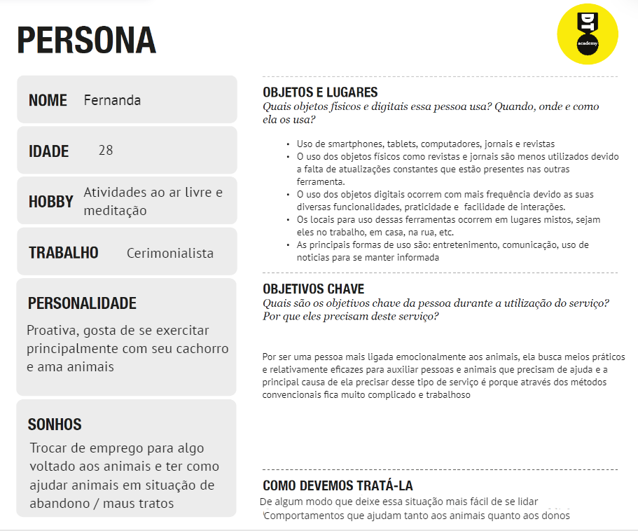

> **Mapa de empatia - Fernanda**
> 
> 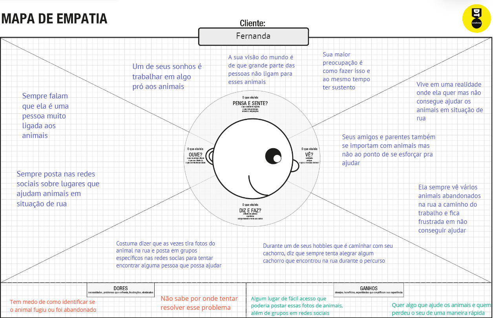

> **Persona - PetShop**
> 
> 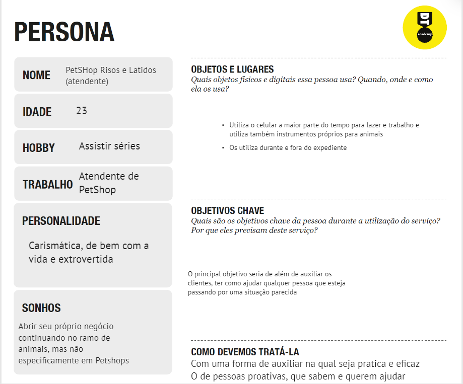

> **Mapa de empatia - PetShop**
> 
> 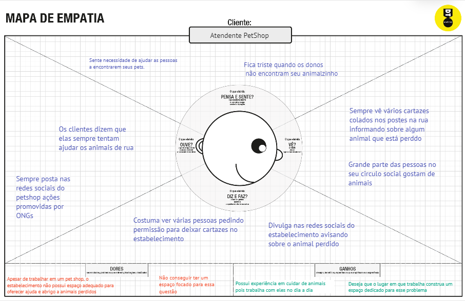

> **Persona - Ricardo**
> 
> 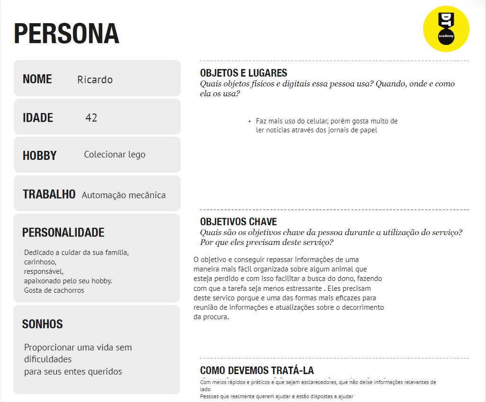

> **Mapa de empatia - Ricardo**
> 
> 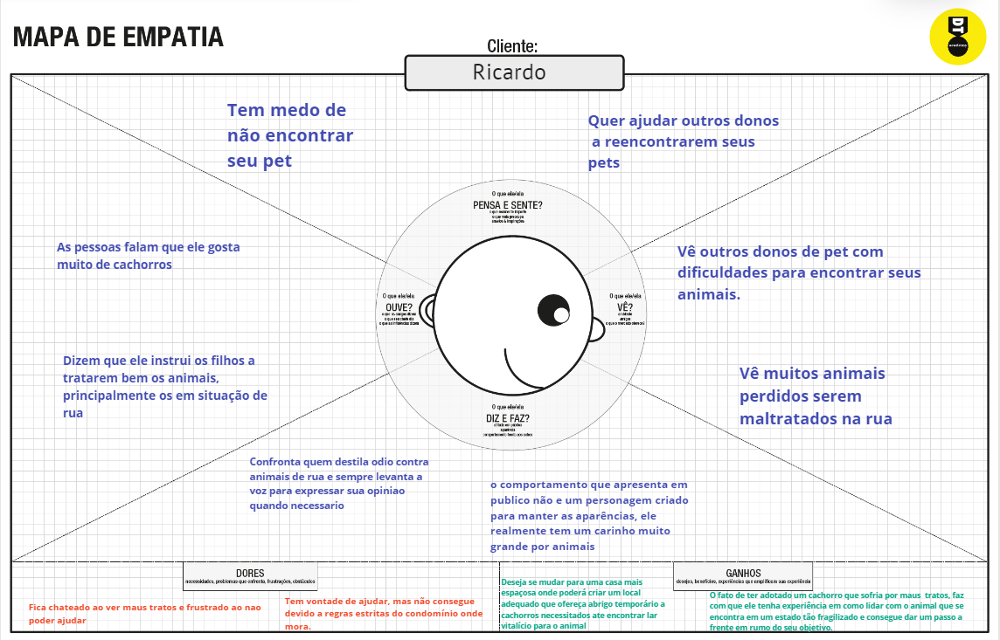

## Histórias de Usuários

Com base na análise das personas forma identificadas as seguintes histórias de usuários:

|Eu como Ricardo|quero resgatar animais perdidos|Para trazer felicidade aos seus donos.|
|--------------------|------------------------------------|----------------------------------------|
|Usuário do sistema  | Registrar minhas tarefas           | Não esquecer de fazê-las               |
|Administrador       | Alterar permissões                 | Permitir que possam administrar contas |

> Apresente aqui as histórias de usuário que são relevantes para o
> projeto de sua solução. As Histórias de Usuário consistem em uma
> ferramenta poderosa para a compreensão e elicitação dos requisitos
> funcionais e não funcionais da sua aplicação. Se possível, agrupe as
> histórias de usuário por contexto, para facilitar consultas
> recorrentes à essa parte do documento.
>
> **Links Úteis**:
> - [Histórias de usuários com exemplos e template](https://www.atlassian.com/br/agile/project-management/user-stories)
> - [Como escrever boas histórias de usuário (User Stories)](https://medium.com/vertice/como-escrever-boas-users-stories-hist%C3%B3rias-de-usu%C3%A1rios-b29c75043fac)

## Requisitos

As tabelas que se seguem apresentam os requisitos funcionais e não funcionais que detalham o escopo do projeto.

### Requisitos Funcionais

|ID    | Descrição do Requisito  | Prioridade |
|------|-----------------------------------------|----|
|RF-001| Permitir que o usuário cadastre tarefas | ALTA | 
|RF-002| Emitir um relatório de tarefas no mês   | MÉDIA |

### Requisitos não Funcionais

|ID     | Descrição do Requisito  |Prioridade |
|-------|-------------------------|----|
|RNF-001| O sistema deve ser responsivo para rodar em um dispositivos móvel | MÉDIA | 
|RNF-002| Deve processar requisições do usuário em no máximo 3s |  BAIXA | 

> Com base nas Histórias de Usuário, enumere os requisitos da sua
> solução. Classifique esses requisitos em dois grupos:
>
> - [Requisitos Funcionais (RF)](https://pt.wikipedia.org/wiki/Requisito_funcional):
>   correspondem a uma funcionalidade que deve estar presente na
>   plataforma (ex: cadastro de usuário).
>
> - [Requisitos Não Funcionais (RNF)](https://pt.wikipedia.org/wiki/Requisito_n%C3%A3o_funcional):
>   correspondem a uma característica técnica, seja de usabilidade,
>   desempenho, confiabilidade, segurança ou outro (ex: suporte a
>   dispositivos iOS e Android).
>
> Lembre-se que cada requisito deve corresponder à uma e somente uma
> característica alvo da sua solução. Além disso, certifique-se de que
> todos os aspectos capturados nas Histórias de Usuário foram cobertos.
> 
> **Links Úteis**:
> 
> - [O que são Requisitos Funcionais e Requisitos Não Funcionais?](https://codificar.com.br/requisitos-funcionais-nao-funcionais/)
> - [O que são requisitos funcionais e requisitos não funcionais?](https://analisederequisitos.com.br/requisitos-funcionais-e-requisitos-nao-funcionais-o-que-sao/)

## Restrições

O projeto está restrito pelos itens apresentados na tabela a seguir.

|ID| Restrição                                             |
|--|-------------------------------------------------------|
|01| O projeto deverá ser entregue até o final do semestre |
|02| Não pode ser desenvolvido um módulo de backend        |

> Enumere as restrições à sua solução. Lembre-se de que as restrições
> geralmente limitam a solução candidata.
> 
> **Links Úteis**:
> - [O que são Requisitos Funcionais e Requisitos Não Funcionais?](https://codificar.com.br/requisitos-funcionais-nao-funcionais/)
> - [O que são requisitos funcionais e requisitos não funcionais?](https://analisederequisitos.com.br/requisitos-funcionais-e-requisitos-nao-funcionais-o-que-sao/)

# Projeto de Interface

......  COLOQUE AQUI O SEU TEXTO DE INTRODUÇÃO ......

> Apresente as principais interfaces da solução. Discuta como 
> foram elaboradas de forma a atender os requisitos funcionais, não
> funcionais e histórias de usuário abordados nas [Especificações do
> Projeto](#especificações-do-projeto).

## User Flow

> **Fluxo de usuário**:
> 
> 

## Wireframes

> **Login**:
> 
> 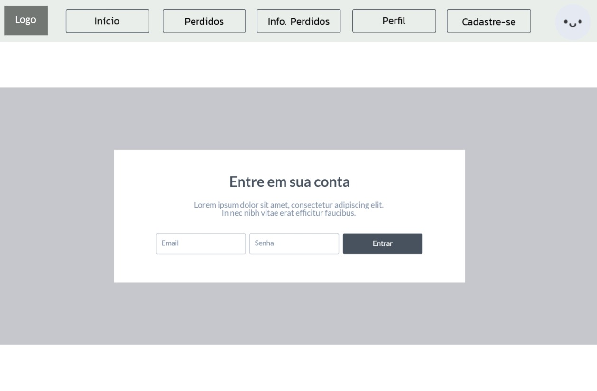

> **Cadastro do usuário**:
> 
> 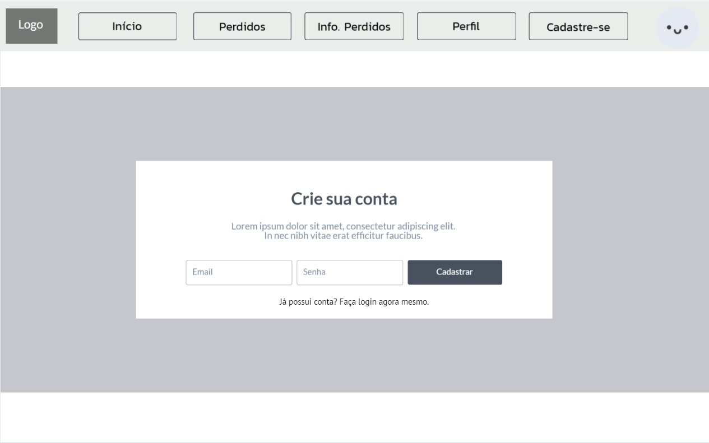

> **Perfil**:
> 
> 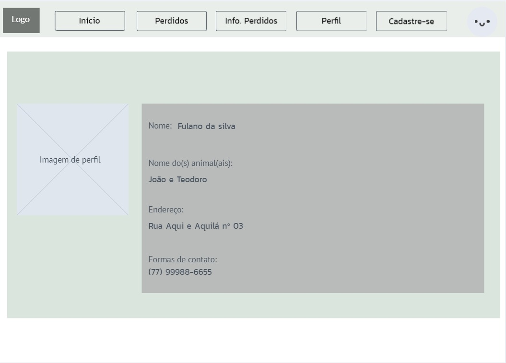

> **Home**:
> 
> 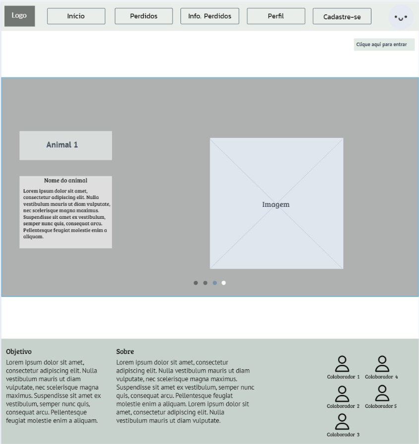

> **Animais perdidos**:
> 
> 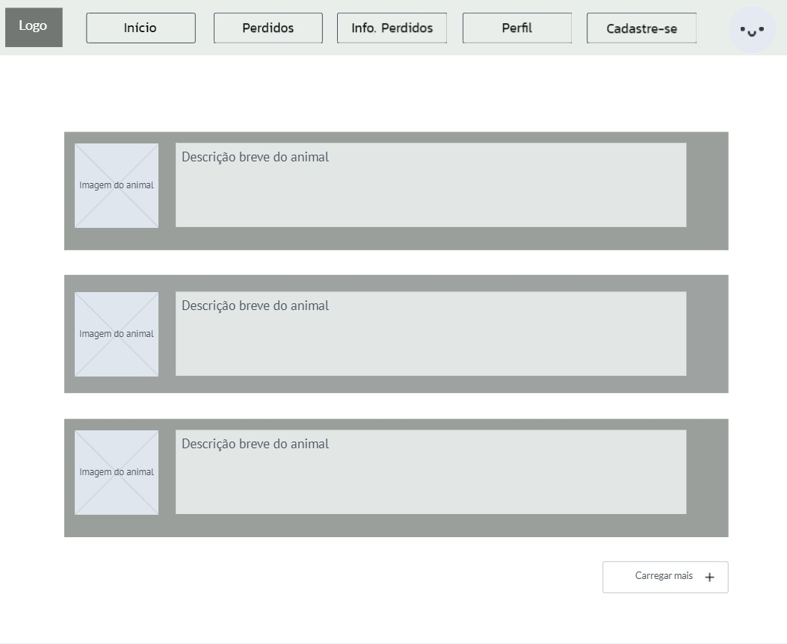

> **Mais informações sobre o animal**:
> 
> 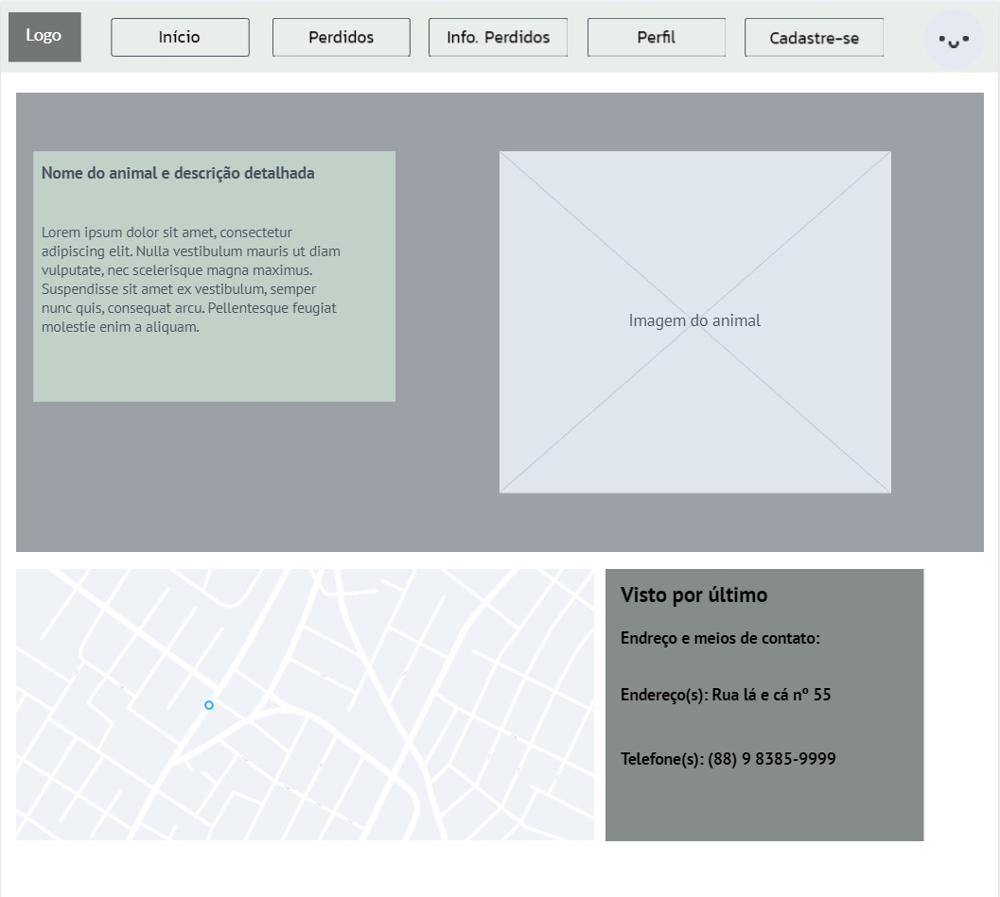

# Metodologia

O projeto está sendo feito com cada integrante possuindo uma determinada função, e contando com a ajuda dos demais caso necessite e o scrum master
realizando a própria função e auxiliando os demais.

As ferramentas que estão sendo utilizadas no momento são [Miro](https://miro.com/), para definir as ideias, [MarvelApp](https://marvelapp.com/), para construir o wireframe do site, [Github](https://github.com/), para controlar o versionamento do codigo, [Trello](https://trello.com/en), para organizar as tarefas e [Discord](https://discord.com/), onde são feitas as reuniões. 

## Divisão de Papéis

| Integrante    | Função        |
| ------------- | ------------- |
| Hugo        | Design, redação e Scrum Master  |
| Maria        | Redação  |
| Roberto  | Design  |
| Amanda        | Design  |
| João        | Redação  |

## Ferramentas

| Ambiente  | Plataforma              |Link de Acesso |
|-----------|-------------------------|---------------|
|Processo de Design Thinkgin  | Miro | https://miro.com/app/board/uXjVOBuEnd0=/ | 
|Repositório de código | GitHub | https://github.com/ICEI-PUC-Minas-PPLCC-TI/tiaw-ppl-cc-m-20221-animais-perdidos | 
|Hospedagem do site | Heroku |  https://XXXXXXX.herokuapp.com | 
|Protótipo Interativo | MavelApp | https://marvelapp.com/prototype/177gd1ae | 

Outras ferramentas utilizadas no projeto:

**Editor de código**
- Visual Studio Code
> IDE onde é possível aumentar a produtividade com a utilização de extensões

**Comunicação**
- [Discord](https://discord.com/)
- Podendo migrar para o [Slack](https://slack.com/)
> Aplicativos voltados a comunicação, sendo o Slack mais próprio para trabalhos

**Diagramação**
- [Figma](https://www.figma.com/)
> Plataforma onde foi feita a diagramação do fluxo de usuários, foi escolhida por ser bem simples e prática

**Hospedagem**
>Será atualizada quando o site começar a ser desenvolvido, porém já temos alguns em mente, como exemplo o [netlify](https://www.netlify.com/) 

## Controle de Versão

......  COLOQUE AQUI O SEU TEXTO ......

> Discuta como a configuração do projeto foi feita na ferramenta de
> versionamento escolhida. Exponha como a gerência de tags, merges,
> commits e branchs é realizada. Discuta como a gerência de issues foi
> realizada.
> A ferramenta de controle de versão adotada no projeto foi o
> [Git](https://git-scm.com/), sendo que o [Github](https://github.com)
> foi utilizado para hospedagem do repositório `upstream`.
> 
> O projeto segue a seguinte convenção para o nome de branchs:
> 
> - `master`: versão estável já testada do software
> - `unstable`: versão já testada do software, porém instável
> - `testing`: versão em testes do software
> - `dev`: versão de desenvolvimento do software
> 
> Quanto à gerência de issues, o projeto adota a seguinte convenção para
> etiquetas:
> 
> - `bugfix`: uma funcionalidade encontra-se com problemas
> - `enhancement`: uma funcionalidade precisa ser melhorada
> - `feature`: uma nova funcionalidade precisa ser introduzida
>
> **Links Úteis**:
> - [Tutorial GitHub](https://guides.github.com/activities/hello-world/)
> - [Git e Github](https://www.youtube.com/playlist?list=PLHz_AreHm4dm7ZULPAmadvNhH6vk9oNZA)
> - [5 Git Workflows & Branching Strategy to deliver better code](https://zepel.io/blog/5-git-workflows-to-improve-development/)
>
> **Exemplo - GitHub Feature Branch Workflow**:
>
> 

# **############## SPRINT 1 ACABA AQUI #############**

# Projeto da Solução

......  COLOQUE AQUI O SEU TEXTO ......

## Tecnologias Utilizadas

......  COLOQUE AQUI O SEU TEXTO ......

> Descreva aqui qual(is) tecnologias você vai usar para resolver o seu
> problema, ou seja, implementar a sua solução. Liste todas as
> tecnologias envolvidas, linguagens a serem utilizadas, serviços web,
> frameworks, bibliotecas, IDEs de desenvolvimento, e ferramentas.
> Apresente também uma figura explicando como as tecnologias estão
> relacionadas ou como uma interação do usuário com o sistema vai ser
> conduzida, por onde ela passa até retornar uma resposta ao usuário.
> 
> Inclua os diagramas de User Flow, esboços criados pelo grupo
> (stoyboards), além dos protótipos de telas (wireframes). Descreva cada
> item textualmente comentando e complementando o que está apresentado
> nas imagens.

## Arquitetura da solução

......  COLOQUE AQUI O SEU TEXTO E O DIAGRAMA DE ARQUITETURA .......

> Inclua um diagrama da solução e descreva os módulos e as tecnologias
> que fazem parte da solução. Discorra sobre o diagrama.
> 
> **Exemplo do diagrama de Arquitetura**:
> 
> 

# Avaliação da Aplicação

......  COLOQUE AQUI O SEU TEXTO ......

> Apresente os cenários de testes utilizados na realização dos testes da
> sua aplicação. Escolha cenários de testes que demonstrem os requisitos
> sendo satisfeitos.

## Plano de Testes

......  COLOQUE AQUI O SEU TEXTO ......

> Enumere quais cenários de testes foram selecionados para teste. Neste
> tópico o grupo deve detalhar quais funcionalidades avaliadas, o grupo
> de usuários que foi escolhido para participar do teste e as
> ferramentas utilizadas.
> 
> **Links Úteis**:
> - [IBM - Criação e Geração de Planos de Teste](https://www.ibm.com/developerworks/br/local/rational/criacao_geracao_planos_testes_software/index.html)
> - [Práticas e Técnicas de Testes Ágeis](http://assiste.serpro.gov.br/serproagil/Apresenta/slides.pdf)
> -  [Teste de Software: Conceitos e tipos de testes](https://blog.onedaytesting.com.br/teste-de-software/)

## Ferramentas de Testes (Opcional)

......  COLOQUE AQUI O SEU TEXTO ......

> Comente sobre as ferramentas de testes utilizadas.
> 
> **Links Úteis**:
> - [Ferramentas de Test para Java Script](https://geekflare.com/javascript-unit-testing/)
> - [UX Tools](https://uxdesign.cc/ux-user-research-and-user-testing-tools-2d339d379dc7)

## Registros de Testes

......  COLOQUE AQUI O SEU TEXTO ......

> Discorra sobre os resultados do teste. Ressaltando pontos fortes e
> fracos identificados na solução. Comente como o grupo pretende atacar
> esses pontos nas próximas iterações. Apresente as falhas detectadas e
> as melhorias geradas a partir dos resultados obtidos nos testes.

# Referências

......  COLOQUE AQUI O SEU TEXTO ......

> Inclua todas as referências (livros, artigos, sites, etc) utilizados
> no desenvolvimento do trabalho.
> 
> **Links Úteis**:
> - [Formato ABNT](https://www.normastecnicas.com/abnt/trabalhos-academicos/referencias/)
> - [Referências Bibliográficas da ABNT](https://comunidade.rockcontent.com/referencia-bibliografica-abnt/)
